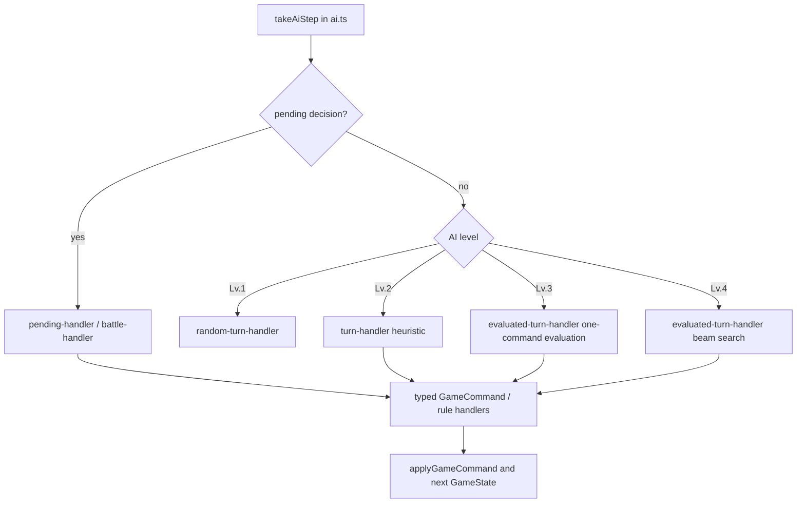

# 通用策略 Phase G0 現況基線與稽核

> 盤點日期：2026-08-16。此文件只記錄現有程式行為與後續測試規格；不變更 AI 決策。開始 G0 時的可追溯測試基線為 Vitest **190 files / 3,110 tests**（來自同一工作樹最近一次完整驗證）；G0 為文件變更，未以此數字宣稱重新執行完整套件。

## G0 任務契約

| 欄位 | 內容 |
| --- | --- |
| 任務類型 | `ai`、`tests`、`docs-workflow` |
| 目標 | 完成通用 Lv.3／Lv.4 策略的設計契約、能力分類、知識邊界與可量測基線。 |
| 相關檔案 | `src/game/ai.ts`、`src/game/ai/*handler.ts`、`skill-value.ts`、`ability-effects.ts`、`rule-profiles.ts`、`bs2MatchupProfiles.ts`、`player-view.ts`、`commands.ts`、`ai-detailed-sim.ts`、`ai-level-benchmark.test.ts`。 |
| 不可修改 | 任何 AI 決策、正式卡牌規則／資料、UI、線上協議、Lv.1／Lv.2 行為。 |
| 本階段驗收 | 四份文件、分數消費者分類、測試／benchmark 規格、Blocking Decisions；完成即停止等待 G1 核准。 |
| 本階段驗證 | 文件差異檢查與完整 diff review；不為文件規格重跑 AI benchmark。 |

## 現有行動流程

`takeAiStep` 目前會依 level dispatch：Lv.3 走 `handleAiEvaluatedTurnState`，Lv.4 走 `handleAiTwoPlyTurnState`。`simulateAiMatch` 的預設 action cap 是 500。現有策略的主要路徑透過 command／既有 handler 推進 state，但舊策略仍直接取用 `GameState`，尚未強制為 `PlayerView + KnowledgeState` 的唯一路徑。

## 模組盤點

| 項目 | 現有位置 | 現況 | G1～G5 整合方向 |
| --- | --- | --- | --- |
| Candidate generation | `turn-handler.ts`、`evaluated-turn-handler.ts`、`commands.ts`／現有 rule handler | Lv.3 以可套用的一步候選評估；非 pending 的 Lv.2 為固定啟發式順序。 | G3 枚舉全部合法 `GameCommand`，每個候選保留可解釋 breakdown。 |
| 一步評估 | `evaluatePlayerView`、`evaluateCandidate` | 以公開計數、戰鬥區、手牌、支援、break、牌庫與場景組合 heuristic。 | G3 疊加 R12～R15、已知 payoff、資源保留與未知資訊扣分。 |
| Beam Search | `handleAiTwoPlyTurnState`、`exploreBeam` | 現為同回合 beam width 3、depth 3 的候選序列搜索。 | G4 調整為 width 4～6、depth 4～6、150～350 nodes、100～250ms，逾時回退 Lv.3。 |
| Pending decisions | `pending-handler.ts` | 覆蓋 effect order、faint、after damage、HP、discard、rest support、inspect、reveal、optional cost、draw、stage trigger 等。多處使用第一個／排序後前幾個合法候選。 | G5 以 TacticalPlan 評估付款、目標、順序與略過，但仍由規則層驗證。 |
| 戰鬥防守 | `battle-handler.ts` | 處理 damage、FLIP、trap、blocker、attack response；有 trap／block heuristic。 | G5 接入 blocker、trap、FLIP 的風險／計畫值。 |
| Skill fallback | `skill-value.ts` | 已能從 effect kind 估計未列入舊表的效果值；沒有完整 capability／不支援 telemetry。 | G1 改由 capability evidence 產生中性／保守 fallback。 |
| Effect execution bridge | `ability-effects.ts` | 將 AI 選擇轉成規則層可執行的 effect 流程。 | 維持 command／rules 為唯一權威，策略只提供合法選擇。 |
| Rule profile | `rule-profiles.ts` | 已有 R1～R11；Lv.3 有 R5～R8，Lv.4 有 R9～R11 與程式列入的 R6c。 | G1～G4 新增 R12～R16；先解決 R6c 文件不一致。 |
| Card-id overrides | `bs2MatchupProfiles.ts` | 替補、威脅、低價值與效果加分含大量完整 `card.id` 表；另依能量色選舊 matchup profile。 | 通用策略不得依此選擇 profile；僅可保留受稽核 `card.id` 人工例外。 |
| Public view | `player-view.ts` | 對手手牌僅 count、HP 僅 count；公開區完整可見。 | G2 所有策略讀取移至 PlayerView 加 KnowledgeState。 |
| Telemetry／benchmark | `ai-detailed-sim.ts`、`ai-level-benchmark.test.ts`、browser validation script | 已記錄 action cap、stuck、deadlock、invalid action、replacement、attack、R7／R10／R6c 等指標，也會輸出 seed diagnostic JSON。 | G3～G5 擴充 timing、setup/payoff、reservation、unknown／unsupported 與 ReplayIssueBundle。 |

## 現有卡牌相依與 fallback 稽核

`bs2MatchupProfiles.ts` 的完整 `card.id` 查表與依牌色選 profile，是舊機制，不符合本計畫「牌組無關、彈數無關」的策略來源；G0 不刪除它，避免改變 Lv.1／Lv.2 與既有行為。G3／G4 會以 `DeckStrategyProfile` 取代其作為通用策略輸入。

`skill-value.ts` 與 `battle-handler.ts` 已有「查不到舊表時讀 `skill.effects`」的 fallback，這是 G1 capability extractor 的可重用起點，但仍需把未知效果顯式標成 `unsupported`，不可將缺資料當成確定 combo。

## 隱藏資訊基線

`createPlayerView` 已遮蔽對手手牌內容、牌庫身分與所有未翻開 HP；其公開資訊包括雙方手牌／牌庫張數、公開區與戰鬥區 HP 張數。現有 `evaluatePlayerView` 讀的是此 view，但 pending、replacement、attack target 與 effect handler 仍有直接 `GameState` 讀取。因此 G2 的核心不是再遮蔽一次 UI，而是使策略評估、記憶與搜索只能從合法 public view 與明確 knowledge facts 得到隱藏資訊以外的內容。

## 分數生產者與消費者稽核

下表涵蓋現行 `src/game/ai` 與 `src/game/ai.ts` 中參與決策的 score producer／consumer。`RelativeActionScore` 代表只可排序；`CalibratedSignal` 代表可用固定條件的具名量／布林。

| 生產者／條件 | 消費者 | 現況分類 | G0 結論 |
| --- | --- | --- | --- |
| `evaluatePlayerView` 的 board／HP／hand／support／break 加總 | Lv.3 candidate 排序、Lv.4 beam state 比較 | `RelativeActionScore` | 可排序；不得再以綜合值推論終局。 |
| `evaluateCandidate`、attack／skill／item／tempo／risk bonus | Lv.3 best candidate、Lv.4 beam | `RelativeActionScore` | G3 要輸出逐項 `ActionScoreBreakdown`。 |
| `candidate.score >= 100000` in `isDecisiveTwoPlyCandidate` | Lv.4 是否覆蓋 Lv.3 候選 | **不相容的固定門檻風險** | 現行綜合分數被用作固定 threshold；G4 必須改由 explicit terminal／winning command signal。 |
| `handQuality >= 30` | Lv.2 是否部署 cookie | **不相容的固定門檻風險** | `evaluateHandQuality` 是 legacy profile 相對值且 fallback 50；G0 不改 Lv.2，G3 不得複製此模式。 |
| `scoreAttackTarget`、`scoreReplacement`、`scoreReplacementAdvanced` | `ai.ts` 替補／目標排序 | `RelativeActionScore` | 可在候選內排序；舊 profile／card-id 表須被通用模型取代。 |
| `getCardEffectValue`、`estimateSkillEffectValue` | replacement、trap／block cookie value、skill 選擇 | `RelativeActionScore` | fallback 可保留；需加 capability evidence 與 unsupported telemetry。 |
| trap worth | `battle-handler.ts` 選最高 trap | `RelativeActionScore` | 正常排序用途；不可升格為固定合法性門檻。 |
| block worth 與 `BLOCK_SKIP_THRESHOLD = 0` | 是否使用 blocker | **不相容的固定門檻風險** | 相對效用被零門檻消費；G5 要改成 calibrated opportunity cost／plan comparison。 |
| `RAMP_ENERGY_TARGET = 5` | cookie-as-support penalty 啟用 | `CalibratedSignal`（active support count） | 可用固定門檻，但須保留單位與邊界測試。 |
| break level 6／8／10、HP count、card level、energy cost、hand count | R1/R7/R8/R9/R10 與防守評估 | `CalibratedSignal` | 這些是規則／公開計數；其上疊加的 bonus 仍是 relative。 |
| beam width 3、depth 3、action cap 500 | 搜尋／模擬控制 | `CalibratedSignal`（資源預算） | G4 以 node limit 與 wall-clock budget 取代只靠深度。 |
| detailed simulation metrics | benchmark quality gate／報表 | `CalibratedSignal` | 非行動 score；可安全設 stuck／deadlock／invalid action 的零門檻。 |

### 必須解決的相對分數門檻問題

1. `handQuality >= 30`：舊 profile 查表、fallback 50 與固定門檻耦合，不能作為新通用策略的範例。
2. `candidate.score >= 100000`：雖然來源含終局 sentinel，但綜合分數本身沒有型別保護；G4 要改成顯式終局結果。
3. `BLOCK_SKIP_THRESHOLD = 0`：以相對 heuristic 值決定略過，G5 要納入可解釋的防守機會成本與 TacticalPlan。

## Benchmark 與 telemetry 基線

現有 detailed simulation／benchmark 已覆蓋或輸出：

- stuck、deadlock、invalid action、turn cap、turn progression。
- replacement 次數、平均分數／rank、低品質替補。
- attack kill rate、overkill、lethal opportunity／conversion、direct win。
- skill usage、R7 trap skip、R10 與 R6c 稽核計數。
- 失敗時的 seed、對局記錄、最後狀態與 `test-results/ai-benchmark/*seed*.json` diagnostics。

後續 benchmark 必增：平均／p95／最大決策時間、setup 次數、payoff 完成率、combo 放棄率、致命漏失、合法攻擊略過、未知資訊誤判、unsupported effect、資源預留成功率，以及每個失敗的 `ReplayIssueBundle`（seed、牌組、command log、最後 state）。

驗收樣本：PR 快速測試 60 seeds；正式比較 300 seeds；勝率差距小於約 3pp 時提升至 1,000 seeds。Dedicated deterministic fixtures 必須有 stuck = 0、deadlock = 0、invalid action = 0。通用性應以六種能力分布 fixture（牌庫底、支援區、Active／Rest、棄牌區、快攻、控制）測試；測試與正式程式不得以這些名稱或彈數作判斷。

## 後續測試規格

### Lv.3

- 優先完成已知 payoff；低價值 setup 不得放棄確定擊暈。
- 未知條件不可被評為必定成功；combo 不可完成時仍維持正常合法攻擊節奏。
- 同 state／seed／knowledge 的 command 與 breakdown 必須相同。

### Lv.4

- 可找出兩步與三步 setup → payoff；能為後續攻擊保留可支付資源。
- 致命優先於 combo；防守優先於非必要 setup；比較攻擊風險與不攻擊機會成本。
- node／time budget 用盡時直接採 Lv.3 最佳候選並記錄 fallback。
- 不得把隱藏資訊推成最有利或最不利確定結果。

### Pending／防守

- replacement、payment、target、ordered target、choose-one、discard、blocker、trap、FLIP、refresh、多階段效果均以合法候選及 TacticalPlan 選擇。
- 每個路徑同時驗證可執行與不可執行兩條情境；規則層是最終合法性裁決者。

## Blocking Decisions

| ID | 未決事項 | 在裁決前的行為 |
| --- | --- | --- |
| BD-G0-1 | 何種 inspect／reveal／重排／移動效果應使 deck sequence version 失效，及 command log 是否已完整標示。 | G2 不保存可能失效的牌序。 |
| BD-G0-2 | 對手曾公開展示的手牌在後續移動前，是否可作為「仍在手牌」的 knowledge fact。 | 只保存展示事件，不作目前手牌身分推論。 |
| BD-G0-3 | R6c 在文件為 Deferred、程式卻列入 Lv.4 profile 的真正產品狀態。 | 不以 R6c 是否 active 作新模型前提。 |
| BD-G0-4 | card.id 人工例外的存續政策、審核人與移除條件。 | 新通用策略不新增例外；只登錄既有依賴。 |
| BD-G0-5 | 任何尚無結構化 `CardEffect` 或規則效果語意的卡。 | 中性／保守 fallback 加 telemetry，不能猜測 combo。 |

## G0 結束條件

本文件與其餘三份 G0 文件完成後，即停止，不建立 `src/game/ai/strategy/`、不改 `rule-profiles.ts`、不接入 shadow mode，也不啟動 G1。G1 必須取得明確核准後才開始。
