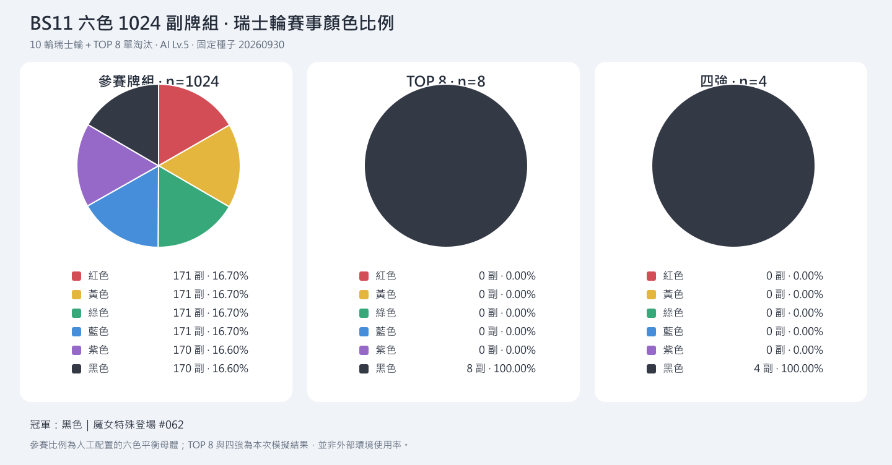

# BS11 六色 1024 副牌組瑞士輪

結果：**PASS**。Swiss 5120/5120 完成，0 場卡住／超限；決賽 PASS。
冠軍：黑色｜魔女特殊登場 #062；亞軍：黑色｜魔女特殊登場 #117。
四強：黑色｜魔女特殊登場 #062、黑色｜魔女特殊登場 #103、黑色｜魔女特殊登場 #117、黑色｜魔女特殊登場 #092。
所有對局均已取得實際勝者。

10 輪 Swiss，勝3分、未完成沿用現行引擎各1分並標記 FAIL；Buchholz／勝率／預先種子次序排序。TOP 8 採 1v8、4v5、2v7、3v6 固定單淘汰。
AI Lv.5 baseline、seed 20260930、單局 500 步；參賽比例由六色平衡分配，並非外部環境使用率。每副主牌至少48/60張 BS11，所有構築皆依 checkout 的 Standard 禁限快照驗證。
本報告使用 Node 純規則模擬，不代表 Browser／線上逐卡驗收，也不是已證明真人最強的構築。

## TOP 8（瑞士輪種子順位）

| 種子 | 牌組 | 顏色 | 分數 | 勝-敗-未完成 | Buchholz |
| --- | --- | --- | --- | --- | --- |
| 1 | 黑色｜魔女特殊登場 #130 | 黑 | 30 | 10-0-0 | 213 |
| 2 | 黑色｜魔女特殊登場 #138 | 黑 | 27 | 9-1-0 | 219 |
| 3 | 黑色｜魔女特殊登場 #092 | 黑 | 27 | 9-1-0 | 207 |
| 4 | 黑色｜魔女特殊登場 #103 | 黑 | 27 | 9-1-0 | 207 |
| 5 | 黑色｜魔女特殊登場 #089 | 黑 | 27 | 9-1-0 | 204 |
| 6 | 黑色｜魔女特殊登場 #029 | 黑 | 27 | 9-1-0 | 201 |
| 7 | 黑色｜魔女特殊登場 #117 | 黑 | 27 | 9-1-0 | 192 |
| 8 | 黑色｜魔女特殊登場 #062 | 黑 | 27 | 9-1-0 | 192 |

## 各色比例

| 顏色 | 參賽副數 | 參賽比例 | TOP 8 | 四強 |
| --- | --- | --- | --- | --- |
| 紅 | 171 | 16.70% | 0 | 0 |
| 黃 | 171 | 16.70% | 0 | 0 |
| 綠 | 171 | 16.70% | 0 | 0 |
| 藍 | 171 | 16.70% | 0 | 0 |
| 紫 | 170 | 16.60% | 0 | 0 |
| 黑 | 170 | 16.60% | 8 | 4 |

## 八強完整牌表

### 黑色｜魔女特殊登場 #130

低等級黑色餅乾供 Mold／Pom-pom／Venom Special Play，再接 Dark Enchantress；Castle／Emblem 維持資源與 Awaken 條件。

BS11 主牌 58/60；0 場未完成。

| 卡號 | 卡名 | 張數 |
| --- | --- | --- |
| BS11-092 | Licorice Cookie | 3 |
| BS11-093 | Poison Mushroom Cookie | 1 |
| BS11-094 | Jam Skelecake Grunt | 4 |
| BS11-095 | Matcha Cookie | 4 |
| BS11-098 | Cream Skelecake Archer | 4 |
| BS11-100 | Agar Agar Cookie | 4 |
| BS11-102 | Cake Warrior | 3 |
| BS11-103 | Skelecake Bomber | 4 |
| BS11-104 | Cake Witch | 4 |
| BS11-106 | World-reflecting Mirrors | 3 |
| BS11-108 | Dark Enchantress's Castle | 4 |
| BS11-109 | Emblem of Darkness | 4 |
| BS11-110 | Draining Magic Circle | 1 |
| BS11-111 | Mold Dough Cookie | 4 |
| BS11-112 | Pom-pom Dough Cookie | 3 |
| BS11-113 | Venom Dough Cookie | 4 |
| BS11-115 | Dark Enchantress Cookie | 4 |
| P-147 | Licorice Cookie | 2 |

EXTRA：BS11-116 Dark Enchantress Cookie ×4、BS11-091 Avatar of Destiny ×2

### 黑色｜魔女特殊登場 #138

低等級黑色餅乾供 Mold／Pom-pom／Venom Special Play，再接 Dark Enchantress；Castle／Emblem 維持資源與 Awaken 條件。

BS11 主牌 59/60；0 場未完成。

| 卡號 | 卡名 | 張數 |
| --- | --- | --- |
| BS11-092 | Licorice Cookie | 4 |
| BS11-094 | Jam Skelecake Grunt | 4 |
| BS11-095 | Matcha Cookie | 4 |
| BS11-098 | Cream Skelecake Archer | 4 |
| BS11-100 | Agar Agar Cookie | 4 |
| BS11-102 | Cake Warrior | 3 |
| BS11-103 | Skelecake Bomber | 4 |
| BS11-104 | Cake Witch | 4 |
| BS11-106 | World-reflecting Mirrors | 3 |
| BS11-107 | Oven of Burning Fate | 2 |
| BS11-108 | Dark Enchantress's Castle | 4 |
| BS11-109 | Emblem of Darkness | 2 |
| BS11-110 | Draining Magic Circle | 1 |
| BS11-111 | Mold Dough Cookie | 4 |
| BS11-112 | Pom-pom Dough Cookie | 3 |
| BS11-113 | Venom Dough Cookie | 4 |
| BS11-114 | Pomegranate Cookie | 1 |
| BS11-115 | Dark Enchantress Cookie | 4 |
| P-147 | Licorice Cookie | 1 |

EXTRA：BS11-116 Dark Enchantress Cookie ×4、BS11-091 Avatar of Destiny ×2

### 黑色｜魔女特殊登場 #092

低等級黑色餅乾供 Mold／Pom-pom／Venom Special Play，再接 Dark Enchantress；Castle／Emblem 維持資源與 Awaken 條件。

BS11 主牌 59/60；0 場未完成。

| 卡號 | 卡名 | 張數 |
| --- | --- | --- |
| BS11-092 | Licorice Cookie | 4 |
| BS11-094 | Jam Skelecake Grunt | 4 |
| BS11-095 | Matcha Cookie | 3 |
| BS11-096 | Butter Roll Cookie | 1 |
| BS11-098 | Cream Skelecake Archer | 4 |
| BS11-100 | Agar Agar Cookie | 4 |
| BS11-101 | Schwarzwälder | 1 |
| BS11-102 | Cake Warrior | 4 |
| BS11-103 | Skelecake Bomber | 3 |
| BS11-104 | Cake Witch | 4 |
| BS11-106 | World-reflecting Mirrors | 3 |
| BS11-108 | Dark Enchantress's Castle | 4 |
| BS11-109 | Emblem of Darkness | 4 |
| BS11-110 | Draining Magic Circle | 1 |
| BS11-111 | Mold Dough Cookie | 4 |
| BS11-112 | Pom-pom Dough Cookie | 4 |
| BS11-113 | Venom Dough Cookie | 3 |
| BS11-115 | Dark Enchantress Cookie | 4 |
| P-147 | Licorice Cookie | 1 |

EXTRA：BS11-116 Dark Enchantress Cookie ×4、BS11-091 Avatar of Destiny ×2

### 黑色｜魔女特殊登場 #103

低等級黑色餅乾供 Mold／Pom-pom／Venom Special Play，再接 Dark Enchantress；Castle／Emblem 維持資源與 Awaken 條件。

BS11 主牌 59/60；0 場未完成。

| 卡號 | 卡名 | 張數 |
| --- | --- | --- |
| BS11-092 | Licorice Cookie | 4 |
| BS11-094 | Jam Skelecake Grunt | 3 |
| BS11-095 | Matcha Cookie | 4 |
| BS11-098 | Cream Skelecake Archer | 4 |
| BS11-099 | Cream Roll Hog Rider | 1 |
| BS11-100 | Agar Agar Cookie | 3 |
| BS11-102 | Cake Warrior | 4 |
| BS11-103 | Skelecake Bomber | 3 |
| BS11-104 | Cake Witch | 4 |
| BS11-105 | Red Velvet Dragon | 2 |
| BS11-106 | World-reflecting Mirrors | 4 |
| BS11-108 | Dark Enchantress's Castle | 4 |
| BS11-109 | Emblem of Darkness | 4 |
| BS11-111 | Mold Dough Cookie | 3 |
| BS11-112 | Pom-pom Dough Cookie | 4 |
| BS11-113 | Venom Dough Cookie | 4 |
| BS11-114 | Pomegranate Cookie | 2 |
| BS11-115 | Dark Enchantress Cookie | 2 |
| P-147 | Licorice Cookie | 1 |

EXTRA：BS11-116 Dark Enchantress Cookie ×4、BS11-091 Avatar of Destiny ×2

### 黑色｜魔女特殊登場 #089

低等級黑色餅乾供 Mold／Pom-pom／Venom Special Play，再接 Dark Enchantress；Castle／Emblem 維持資源與 Awaken 條件。

BS11 主牌 59/60；0 場未完成。

| 卡號 | 卡名 | 張數 |
| --- | --- | --- |
| BS11-092 | Licorice Cookie | 4 |
| BS11-094 | Jam Skelecake Grunt | 4 |
| BS11-095 | Matcha Cookie | 3 |
| BS11-098 | Cream Skelecake Archer | 4 |
| BS11-099 | Cream Roll Hog Rider | 1 |
| BS11-100 | Agar Agar Cookie | 3 |
| BS11-101 | Schwarzwälder | 1 |
| BS11-102 | Cake Warrior | 4 |
| BS11-103 | Skelecake Bomber | 4 |
| BS11-104 | Cake Witch | 4 |
| BS11-106 | World-reflecting Mirrors | 4 |
| BS11-108 | Dark Enchantress's Castle | 4 |
| BS11-109 | Emblem of Darkness | 4 |
| BS11-111 | Mold Dough Cookie | 4 |
| BS11-112 | Pom-pom Dough Cookie | 3 |
| BS11-113 | Venom Dough Cookie | 4 |
| BS11-115 | Dark Enchantress Cookie | 4 |
| P-147 | Licorice Cookie | 1 |

EXTRA：BS11-116 Dark Enchantress Cookie ×4、BS11-091 Avatar of Destiny ×2

### 黑色｜魔女特殊登場 #029

低等級黑色餅乾供 Mold／Pom-pom／Venom Special Play，再接 Dark Enchantress；Castle／Emblem 維持資源與 Awaken 條件。

BS11 主牌 59/60；0 場未完成。

| 卡號 | 卡名 | 張數 |
| --- | --- | --- |
| BS11-092 | Licorice Cookie | 4 |
| BS11-093 | Poison Mushroom Cookie | 1 |
| BS11-094 | Jam Skelecake Grunt | 4 |
| BS11-095 | Matcha Cookie | 4 |
| BS11-096 | Butter Roll Cookie | 2 |
| BS11-098 | Cream Skelecake Archer | 3 |
| BS11-100 | Agar Agar Cookie | 4 |
| BS11-102 | Cake Warrior | 2 |
| BS11-103 | Skelecake Bomber | 4 |
| BS11-104 | Cake Witch | 4 |
| BS11-106 | World-reflecting Mirrors | 4 |
| BS11-108 | Dark Enchantress's Castle | 4 |
| BS11-109 | Emblem of Darkness | 4 |
| BS11-111 | Mold Dough Cookie | 4 |
| BS11-112 | Pom-pom Dough Cookie | 3 |
| BS11-113 | Venom Dough Cookie | 4 |
| BS11-115 | Dark Enchantress Cookie | 4 |
| P-147 | Licorice Cookie | 1 |

EXTRA：BS11-116 Dark Enchantress Cookie ×4、BS11-091 Avatar of Destiny ×2

### 黑色｜魔女特殊登場 #117

低等級黑色餅乾供 Mold／Pom-pom／Venom Special Play，再接 Dark Enchantress；Castle／Emblem 維持資源與 Awaken 條件。

BS11 主牌 59/60；0 場未完成。

| 卡號 | 卡名 | 張數 |
| --- | --- | --- |
| BS11-092 | Licorice Cookie | 4 |
| BS11-094 | Jam Skelecake Grunt | 4 |
| BS11-095 | Matcha Cookie | 2 |
| BS11-097 | Cream Jelly Worm | 1 |
| BS11-098 | Cream Skelecake Archer | 4 |
| BS11-100 | Agar Agar Cookie | 4 |
| BS11-101 | Schwarzwälder | 1 |
| BS11-102 | Cake Warrior | 4 |
| BS11-103 | Skelecake Bomber | 4 |
| BS11-104 | Cake Witch | 4 |
| BS11-106 | World-reflecting Mirrors | 4 |
| BS11-108 | Dark Enchantress's Castle | 4 |
| BS11-109 | Emblem of Darkness | 4 |
| BS11-111 | Mold Dough Cookie | 4 |
| BS11-112 | Pom-pom Dough Cookie | 4 |
| BS11-113 | Venom Dough Cookie | 3 |
| BS11-115 | Dark Enchantress Cookie | 4 |
| P-147 | Licorice Cookie | 1 |

EXTRA：BS11-116 Dark Enchantress Cookie ×4、BS11-091 Avatar of Destiny ×2

### 黑色｜魔女特殊登場 #062

低等級黑色餅乾供 Mold／Pom-pom／Venom Special Play，再接 Dark Enchantress；Castle／Emblem 維持資源與 Awaken 條件。

BS11 主牌 58/60；0 場未完成。

| 卡號 | 卡名 | 張數 |
| --- | --- | --- |
| BS11-092 | Licorice Cookie | 3 |
| BS11-094 | Jam Skelecake Grunt | 4 |
| BS11-095 | Matcha Cookie | 4 |
| BS11-098 | Cream Skelecake Archer | 4 |
| BS11-100 | Agar Agar Cookie | 4 |
| BS11-102 | Cake Warrior | 4 |
| BS11-103 | Skelecake Bomber | 4 |
| BS11-104 | Cake Witch | 4 |
| BS11-106 | World-reflecting Mirrors | 3 |
| BS11-108 | Dark Enchantress's Castle | 4 |
| BS11-109 | Emblem of Darkness | 4 |
| BS11-110 | Draining Magic Circle | 1 |
| BS11-111 | Mold Dough Cookie | 3 |
| BS11-112 | Pom-pom Dough Cookie | 4 |
| BS11-113 | Venom Dough Cookie | 4 |
| BS11-115 | Dark Enchantress Cookie | 4 |
| P-147 | Licorice Cookie | 2 |

EXTRA：BS11-116 Dark Enchantress Cookie ×4、BS11-091 Avatar of Destiny ×2

## 六色種子完整牌表

各色種子主牌均為 BS11 60／60；其餘參賽構築以少量同類型／等級替換產生，全部 1024 副主牌組成不同。全體實際最低 BS11 主牌：紅54、黃54、綠54、藍55、紫54、黑56張。

### 紅色｜樂隊烈焰

[JSON 牌表](../data/decks/bs11-red-seed.json)

| 卡號 | 卡名 | 張數 |
| --- | --- | --- |
| BS11-001 | Raspberry Mousse Cookie | 4 |
| BS11-002 | Macaron Cookie | 4 |
| BS11-003 | Rose Cookie | 4 |
| BS11-005 | Cherry Cola Cookie | 4 |
| BS11-006 | Castanets | 4 |
| BS11-007 | Flat Tofu Cookie | 4 |
| BS11-008 | Raspberry Cookie | 4 |
| BS11-009 | Orb of Eternal Flame | 4 |
| BS11-010 | Flame's Protection | 4 |
| BS11-011 | Canyon of Destruction | 4 |
| BS11-014 | Nutmeg Tiger Cookie | 4 |
| BS11-016 | Fire Spirit Cookie | 4 |
| BS11-017 | Hollyberry Cookie | 4 |
| BS11-018 | Burning Spice Cookie | 4 |
| BS11-090 | White Lily Cookie | 4 |

EXTRA：BS11-091 Avatar of Destiny ×4

### 黃色｜魔法休息區

[JSON 牌表](../data/decks/bs11-yellow-seed.json)

| 卡號 | 卡名 | 張數 |
| --- | --- | --- |
| BS11-019 | Potato Salad Cookie | 4 |
| BS11-020 | Royal Margarine Cookie | 4 |
| BS11-021 | Book of Wizdom | 4 |
| BS11-023 | Chestnut Cookie | 4 |
| BS11-024 | Smoked Cheese Cookie | 4 |
| BS11-025 | Fettuccine Cookie | 4 |
| BS11-026 | Wizard Cookie | 4 |
| BS11-028 | Berry Paradise | 4 |
| BS11-029 | Life's Protection | 4 |
| BS11-030 | Life-Sprouting Jar | 4 |
| BS11-032 | Burnt Cheese Cookie | 4 |
| BS11-034 | Golden Cheese Cookie | 4 |
| BS11-035 | Millennial Tree Cookie | 4 |
| BS11-036 | Eternal Sugar Cookie | 4 |
| BS11-090 | White Lily Cookie | 4 |

EXTRA：BS11-091 Avatar of Destiny ×4

### 綠色｜風弓再活躍

[JSON 牌表](../data/decks/bs11-green-seed.json)

| 卡號 | 卡名 | 張數 |
| --- | --- | --- |
| BS11-038 | Director Q | 4 |
| BS11-039 | Rosemary Cookie | 4 |
| BS11-040 | Melon Bun Cookie | 4 |
| BS11-041 | Peach Blossom Cookie | 4 |
| BS11-042 | Shine Muscat Cookie | 4 |
| BS11-043 | Ginseng Cookie | 4 |
| BS11-044 | Silverbell Cookie | 4 |
| BS11-045 | Grand Dust Hotel | 4 |
| BS11-046 | Awakened Apathy | 4 |
| BS11-048 | Wind's Protection | 4 |
| BS11-049 | Emerald of the Wind | 4 |
| BS11-051 | Mercurial Knight Cookie | 4 |
| BS11-052 | Wind Archer Cookie | 4 |
| BS11-053 | Mystic Flour Cookie | 4 |
| BS11-090 | White Lily Cookie | 4 |

EXTRA：BS11-091 Avatar of Destiny ×4

### 藍色｜海流控制

[JSON 牌表](../data/decks/bs11-blue-seed.json)

| 卡號 | 卡名 | 張數 |
| --- | --- | --- |
| BS11-054 | Net Cookie | 4 |
| BS11-056 | Soda Dollop | 4 |
| BS11-057 | Custard Cookie III | 4 |
| BS11-058 | Cream Soda Cookie | 4 |
| BS11-059 | Seltzer Cookie | 4 |
| BS11-060 | Hero Cookie | 4 |
| BS11-061 | Candy Apple Cookie | 4 |
| BS11-063 | Sea's Protection | 4 |
| BS11-064 | The Breath of the Depths | 4 |
| BS11-065 | Mirror of Destiny | 4 |
| BS11-066 | Milk Lake of Truth | 4 |
| BS11-068 | Black Sapphire Cookie | 4 |
| BS11-069 | Sea Fairy Cookie | 4 |
| BS11-070 | Pure Vanilla Cookie | 4 |
| BS11-090 | White Lily Cookie | 4 |

EXTRA：BS11-091 Avatar of Destiny ×4

### 紫色｜暗可可循環

[JSON 牌表](../data/decks/bs11-purple-seed.json)

| 卡號 | 卡名 | 張數 |
| --- | --- | --- |
| BS11-072 | Dark Choco Cookie | 4 |
| BS11-074 | Chocolate Bark Cookie | 4 |
| BS11-075 | Tea Knight Cookie | 4 |
| BS11-076 | Affogato Cookie | 4 |
| BS11-077 | Dark Spirit Helmet | 4 |
| BS11-078 | Caramel Arrow Cookie | 4 |
| BS11-079 | Espresso Cookie | 4 |
| BS11-082 | Moonlight's Protection | 4 |
| BS11-083 | Catacombs of Lost Solidarity | 4 |
| BS11-084 | Freedom that Broke the Silence | 4 |
| BS11-086 | Crunchy Chip Cookie | 4 |
| BS11-087 | Dark Cacao Cookie | 4 |
| BS11-088 | Moonlight Cookie | 4 |
| BS11-089 | Silent Salt Cookie | 4 |
| BS11-090 | White Lily Cookie | 4 |

EXTRA：BS11-091 Avatar of Destiny ×4

### 黑色｜魔女特殊登場

[JSON 牌表](../data/decks/bs11-black-seed.json)

| 卡號 | 卡名 | 張數 |
| --- | --- | --- |
| BS11-092 | Licorice Cookie | 4 |
| BS11-094 | Jam Skelecake Grunt | 4 |
| BS11-095 | Matcha Cookie | 4 |
| BS11-098 | Cream Skelecake Archer | 4 |
| BS11-100 | Agar Agar Cookie | 4 |
| BS11-102 | Cake Warrior | 4 |
| BS11-103 | Skelecake Bomber | 4 |
| BS11-104 | Cake Witch | 4 |
| BS11-106 | World-reflecting Mirrors | 4 |
| BS11-108 | Dark Enchantress's Castle | 4 |
| BS11-109 | Emblem of Darkness | 4 |
| BS11-111 | Mold Dough Cookie | 4 |
| BS11-112 | Pom-pom Dough Cookie | 4 |
| BS11-113 | Venom Dough Cookie | 4 |
| BS11-115 | Dark Enchantress Cookie | 4 |

EXTRA：BS11-116 Dark Enchantress Cookie ×4、BS11-091 Avatar of Destiny ×2

## 圓餅圖與來源稽核

5120 場瑞士輪＋7 場淘汰賽均已決勝，0 重賽；每副每輪出場一次，全部積分、Buchholz 與淘汰賽勝者經獨立稽核重算。配對先按積分，再以總分差最小的兩桌交換修復重賽；找不到合法交換就停止。

完整 [機器可讀結果](../data/decks/bs11-1024-report.json)、[1024 副構築](../data/decks/bs11-1024-roster.json) 與圓餅圖隨本次變更保存。結果稽核、來源指紋、圖表來源及 Browser 證據屬本機驗證產物，保留於 `output/bs11-1024/*.json` 與 `test-results/`，不納入 Git。來源指紋在最終賽程開始後記錄，完成後核對仍一致。

禁限版本為 checkout 的 2026-02-13 快照。AI 搜尋保留節點／深度限制，以注入固定時鐘排除執行負載造成的耗時降階；搜尋 elapsed telemetry 不代表實際效能時間。四個隔離 worker 使用同一權威引擎，6 副×2 輪的串行／並行逐場結果、步數、排名與統計完全相同。

本輪完整 Vitest 489 檔／5765 項（828.92 秒）、全域 lint、build、AI Browser 6 項均以結束碼0通過。逐卡 UI 的通過範圍與610個待補獨立預期片段見 [自動驗證報告](bs10-bs11-automatic-validation-2026-09-30.md)。
